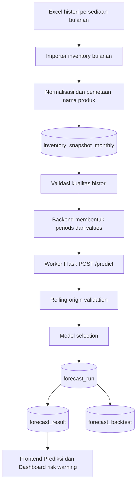

# SACIKA - Prediksi Persediaan Bulanan

SACIKA adalah sistem inventori koperasi dengan pipeline prediksi posisi persediaan akhir bulan. Sistem terbaru menggunakan histori persediaan bulanan dari Excel, memvalidasi kualitas data, memilih model forecasting di worker Flask, menyimpan hasil prediksi, lalu menampilkan risiko stok terhadap batas minimum produk.

## Dokumentasi Terstruktur

- [Instalasi Windows](docs/01-instalasi-windows.md)
- [Database, migration, dan seed](docs/02-database-migration-seed.md)
- [Bootstrap produk dan importer Excel](docs/03-importer-excel.md)
- [Forecasting](docs/04-forecasting.md)
- [Deployment](docs/05-deployment.md)


## Makna Data

`inventory_snapshot_monthly` menyimpan posisi persediaan akhir bulan.

Data ini:

- adalah stok akhir per produk pada tanggal periode bulanan, misalnya `2024-01-01`;
- bukan transaksi penjualan;
- bukan permintaan pelanggan;
- tidak boleh diperlakukan sebagai jumlah barang keluar;
- tidak boleh dipecah menjadi data mingguan.

Kolom `Jml` dari file Excel bulanan disimpan sebagai `stok_akhir`. Produk yang tercantum dengan `Jml = 0` tetap dianggap data observed dengan stok akhir 0. Produk yang tidak tercantum pada sheet bulan tertentu dianggap missing, bukan otomatis 0.

Tabel `dataset_mingguan` dipertahankan hanya untuk kompatibilitas legacy. Endpoint `/api/dataset/aggregate` telah ditandai deprecated; agregasi baru menggunakan `/api/sales/aggregate` dan `penjualan_bulanan`. Pipeline prediksi persediaan bulanan tidak membaca tabel legacy tersebut.

## Pipeline



Urutan proses:

1. File Excel bulanan dibaca dari seluruh sheet Januari 2024 sampai Desember 2025.
2. Importer mengambil kolom `Nama Barang`, `Jml`, `Harga Rata-rata`, dan `Nilai Aset`.
3. Nama produk dinormalisasi dan dicocokkan ke `product_alias` atau produk yang sudah ada.
4. Produk yang tidak cocok dimasukkan ke laporan unresolved, bukan dibuat otomatis.
5. Data tersimpan di `inventory_snapshot_monthly`.
6. Backend menghitung kualitas histori produk.
7. Jika observasi valid kurang dari 18 bulan, forecast ditolak.
8. Backend mengirim `periods` dan `values` langsung ke worker Flask.
9. Worker memilih model terbaik berdasarkan evaluasi rolling-origin.
10. Backend menyimpan metadata model ke `forecast_run`, nilai per periode ke `forecast_result`, dan fold evaluasi ke `forecast_backtest`.
11. Frontend menampilkan estimasi, freshness, rentang indikatif, dan status risiko.

## Model Forecasting

Worker menyediakan kandidat model:

- Naive: prediksi sama dengan observasi terakhir.
- SES: Single Exponential Smoothing dari `statsmodels`.
- Damped Holt: Holt trend dengan `damped_trend=True`.
- ARIMA sederhana: kandidat order terbatas `(1,0,0)`, `(0,1,1)`, dan `(1,1,0)`.

Model dipilih berdasarkan MAE terkecil dari rolling-origin validation. Jika MAE sama atau sangat dekat, RMSE dipakai sebagai tie breaker. Nilai prediksi negatif diubah menjadi 0. Sistem tidak menerapkan batas bawah 1 dan tidak menerapkan batas atas berdasarkan dua kali nilai maksimum historis.

## Evaluasi

Evaluasi memakai rolling-origin validation. Untuk data 24 bulan:

- bulan 1-18 melatih model untuk memprediksi bulan 19;
- bulan 1-19 memprediksi bulan 20;
- proses berlanjut sampai bulan 24;
- total evaluasi normal adalah 6 titik.

Metrik:

- MAE: rata-rata nilai absolut error.
- RMSE: akar rata-rata kuadrat error.
- WAPE: `sum(abs(actual - predicted)) / sum(abs(actual)) * 100`.

Jika denominator WAPE = 0, nilai WAPE adalah `null`.

Sistem tidak menggunakan akurasi `100 - MAPE` untuk pipeline persediaan bulanan.

## Struktur Utama

Backend Express:

- `backend/services/monthlyInventoryImporter.js`: baca Excel bulanan, mapping produk, dry-run, upsert snapshot.
- `backend/services/productNameMapper.js`: normalisasi nama produk.
- `backend/services/inventoryHistoryQualityService.js`: kualitas histori bulanan.
- `backend/services/inventoryForecastService.js`: integrasi worker, batch forecasting, freshness, dan penyimpanan forecast run.
- `backend/services/forecastActualEvaluationService.js`: evaluasi forecast terhadap snapshot aktual.
- `backend/services/salesAggregationService.js`: baseline agregasi transaksi keluar ke `dataset_mingguan` dan `penjualan_bulanan`, tidak dipakai pipeline forecast inventory.

Worker Flask:

- `sacika-worker/app.py`: endpoint `/predict` dan `/health`.
- `sacika-worker/forecasting/models.py`: Naive, SES, Damped Holt, ARIMA sederhana.
- `sacika-worker/forecasting/metrics.py`: rolling-origin validation, MAE, RMSE, WAPE.
- `sacika-worker/forecasting/selector.py`: pemilihan model dan warning.
- `sacika-worker/forecasting/validation.py`: validasi payload.

Frontend React:

- `frontend/src/pages/prediksi/Prediksi.jsx`: halaman prediksi posisi persediaan bulanan.
- `frontend/src/pages/Dashboard.jsx`: ringkasan risiko hasil prediksi terbaru.
- `frontend/src/api/endpoints.js`: endpoint API aktif.

## Database

Tabel baru yang mendukung pipeline:

- `inventory_snapshot_monthly`: histori posisi persediaan akhir bulan.
- `product_alias`: alias dan normalisasi nama produk untuk import.
- `forecast_run`: metadata satu proses forecast, kandidat model, metrik, dan freshness.
- `forecast_result`: nilai prediksi per periode, rentang indikatif, dan realized error.
- `forecast_backtest`: fold rolling-origin model terpilih.
- `import_batch`: log proses import.
- `penjualan_bulanan`: agregasi transaksi keluar aktual untuk data masa depan.

Tabel `dataset_mingguan` tidak dihapus. Tabel ini bukan sumber prediksi persediaan bulanan.

## Menjalankan Migration

Repository memakai migration runner backend dan menjalankan file SQL berdasarkan urutan timestamp.

```powershell
cd backend
npm run db:status
npm run db:migrate
npm run db:status
```

Migration tahap forecast run:

```text
202607200002_refactor_forecast_runs
```

Rollback satu migration terakhir:

```powershell
npm run db:rollback
```

## Importer Excel

Dry-run:

```bash
cd backend
npm run import:inventory -- --file "C:/path/History Penjualan_LaporanBulanan.xlsx" --dry-run --unresolved-output unresolved-products.json
```

Import produksi:

```bash
cd backend
npm run import:inventory -- --file "C:/path/History Penjualan_LaporanBulanan.xlsx" --unresolved-output unresolved-products.json
```

Alternatif environment variable:

```bash
cd backend
IMPORT_FILE_PATH="C:/path/History Penjualan_LaporanBulanan.xlsx" npm run import:inventory
```

Catatan: nama file boleh mengandung kata "Penjualan", tetapi data yang diambil untuk pipeline ini tetap dimaknai sebagai posisi persediaan akhir bulan dari kolom `Jml`.

## Menjalankan Aplikasi

Backend:

```bash
cd backend
npm install
npm start
```

Worker:

```bash
cd sacika-worker
python -m pip install -r requirements.txt
python app.py
```

Frontend:

```bash
cd frontend
npm install
npm run dev
```

## Test

Backend:

```bash
cd backend
npm test
```

Worker:

```bash
cd sacika-worker
python -m unittest discover -s tests
```

Frontend:

```bash
cd frontend
npm test
npm run build
```

Lint frontend:

```bash
cd frontend
npm run lint
```

Catatan saat dokumentasi ini ditulis: test backend, worker, frontend, dan build produksi sudah lulus. Lint frontend masih memiliki error existing di beberapa file UI/report/transaksi yang tidak terkait pipeline prediksi bulanan.

## Environment Variables

Backend:

| Variable | Keterangan | Default |
| --- | --- | --- |
| `DATABASE_URL` | Connection string PostgreSQL. | Wajib |
| `JWT_SECRET` | Secret JWT untuk autentikasi. | Wajib |
| `PORT` | Port backend Express. | `3001` |
| `FORECAST_WORKER_URL` | URL worker Flask untuk forecasting. | `http://localhost:5000` |
| `WORKER_URL` | Fallback URL worker jika `FORECAST_WORKER_URL` kosong. | kosong |
| `FORECAST_WORKER_TIMEOUT_MS` | Timeout request backend ke worker. | `10000` |
| `IMPORT_FILE_PATH` | Path file Excel untuk importer. | kosong |
| `INVENTORY_IMPORT_FILE` | Alias path file Excel untuk importer. | kosong |
| `DRY_RUN` | Jika `true`, importer tidak menulis ke database. | `false` |
| `NODE_ENV` | Jika `production`, koneksi PostgreSQL memakai SSL. | kosong |

Worker:

| Variable | Keterangan | Default |
| --- | --- | --- |
| `PORT` | Port Flask local server. | `5000` |
| `FORECAST_MIN_OBSERVATIONS` | Minimum observasi valid. | `18` |
| `FORECAST_MAX_HORIZON` | Horizon maksimum sementara. | `3` |

Frontend:

| Variable | Keterangan | Default |
| --- | --- | --- |
| `VITE_API_URL` | Base URL backend API. | kosong |

## API

### GET /api/inventory-history/:produk_id

Mengambil histori posisi persediaan akhir bulan.

```http
GET /api/inventory-history/1?start_period=2024-01&end_period=2025-12
```

Response:

```json
{
  "produk": {
    "id": 1,
    "nama": "Aqua Botol 600 ml",
    "stok_saat_ini": 100,
    "stok_minimum": 10
  },
  "target": "ending_inventory",
  "frequency": "monthly",
  "periods": ["2024-01", "2024-02"],
  "values": [100, null],
  "observation_count": 1,
  "missing_periods": ["2024-02"]
}
```

### GET /api/inventory-history/:produk_id/quality

Mengambil kualitas histori satu produk.

```json
{
  "produk_id": 1,
  "observation_count": 24,
  "missing_months": [],
  "zero_ratio": 0,
  "eligible": true,
  "status": "eligible",
  "messages": ["Data layak untuk analisis awal"]
}
```

### POST /api/forecast/inventory/:produk_id

Meminta backend menjalankan forecast inventory bulanan. Backend membaca histori dari PostgreSQL dan mengirim deret waktu langsung ke worker.

Request:

```http
POST /api/forecast/inventory/1
Content-Type: application/json
```

```json
{
  "horizon": 1
}
```

Response:

```json
{
  "forecast_run_id": 50,
  "product_id": 1,
  "target": "ending_inventory",
  "frequency": "monthly",
  "model_used": "SES",
  "forecast_periods": ["2026-01"],
  "forecast_values": [85],
  "forecast_ranges": [
    {"period": "2026-01", "lower_bound": 74.8, "upper_bound": 95.2}
  ],
  "freshness": "current",
  "evaluation": {
    "mae": 10.2,
    "rmse": 12.4,
    "wape": 15.6,
    "test_points": 6
  },
  "candidate_models": [
    {
      "model": "Naive",
      "status": "success",
      "mae": 12,
      "rmse": 14,
      "wape": 18,
      "test_points": 6
    }
  ],
  "backtest": [
    {
      "period": "2025-07",
      "actual": 100,
      "predicted": 95
    }
  ],
  "warning": null,
  "data_cutoff": "2025-12",
  "forecast_result_ids": [10],
  "quality": {
    "observation_count": 24,
    "missing_months": [],
    "zero_ratio": 0,
    "eligible": true,
    "status": "eligible",
    "messages": ["Data layak untuk analisis awal"]
  }
}
```

### GET /api/forecast/inventory/:produk_id/latest

Mengambil hasil forecast terbaru yang tersimpan.

### POST /api/forecast/inventory/batch

Menjalankan forecast seluruh produk aktif dan eligible dengan concurrency terbatas.

### POST /api/forecast/inventory/evaluate-actuals

Membandingkan hasil forecast dengan snapshot aktual yang sudah tersedia.

### GET /api/forecast/inventory-risk

Mengambil ringkasan risiko forecast terbaru beserta freshness dan rentang indikatif.

```json
[
  {
    "produk_id": 1,
    "nama_produk": "Aqua Botol 600 ml",
    "forecast_period": "2026-01",
    "forecast_value": 45,
    "stok_minimum": 60,
    "risk": "high",
    "model_used": "SES"
  }
]
```

### API target monthly_sales

Target ini dibangun dari transaksi keluar aktual dan tidak menggunakan snapshot persediaan.

```http
GET  /api/forecast/sales/:produk_id/history
GET  /api/forecast/sales/:produk_id/readiness
POST /api/forecast/sales/:produk_id/preview
```

Endpoint preview hanya dapat dijalankan administrator, membutuhkan minimal 12 bulan lengkap, dan tetap bersifat eksperimental.

Target ini terpisah dari persediaan:

- `ending_inventory`: histori posisi persediaan akhir bulan.
- `monthly_sales`: transaksi keluar aktual yang sudah diagregasi bulanan.

Aturan status:

- kurang dari 6 bulan: `insufficient_data`;
- 6 sampai 11 bulan: `experimental`;
- minimal 12 bulan: `eligible_basic`;
- minimal 24 bulan: `eligible_full`.

Contoh:

```http
GET /api/forecast/sales/1/readiness
```

```json
{
  "target": "monthly_sales",
  "observation_count": 8,
  "status": "experimental",
  "message": "Prediksi penjualan belum diaktifkan karena histori belum mencukupi."
}
```

### POST /predict Worker

Worker menerima deret waktu langsung dari request body. Worker tidak mengambil dataset kembali dari backend.

```json
{
  "product_id": 1,
  "target": "ending_inventory",
  "frequency": "monthly",
  "periods": ["2024-01", "2024-02"],
  "values": [100, 90],
  "horizon": 1
}
```

## Keterbatasan

- Histori produksi saat ini hanya mencakup maksimal 24 data bulanan.
- Hasil forecast adalah estimasi posisi persediaan akhir bulan, bukan rekomendasi pembelian.
- Faktor barang masuk dan barang keluar belum digunakan pada histori Excel lama.
- Pratinjau target `monthly_sales` hanya dibangun dari transaksi keluar aktual yang benar-benar tercatat di sistem dan tetap bersifat eksperimental.
- Produk yang belum dapat dipetakan dari Excel harus diselesaikan lewat alias/manual review.
- Warning kualitas data tidak mengubah nilai prediksi.

## Perbaikan keamanan dan stabilitas forecast 41–50

Backend sekarang menggunakan Helmet, CORS berbasis environment, dan global
error handler. Worker forecasting dilindungi shared API key. Konfigurasi baru:

```env
FORECAST_WORKER_API_KEY=
FORECAST_MIN_IMPROVEMENT_OVER_NAIVE_PCT=5
FORECAST_MAE_TIE_RELATIVE_TOLERANCE_PCT=1
```

`FORECAST_WORKER_API_KEY` harus sama pada backend dan worker. Panduan lengkap
tersedia pada `README_PERBAIKAN_41-50.md`.

## Perbaikan 51–60

Perbaikan tahap ini menambahkan request limit, request logging dan request ID, soft delete produk/kategori, pagination produk/transaksi/laporan, serta endpoint ringkasan dashboard backend. Lihat `README_PERBAIKAN_51-60.md`.

## Perbaikan 61–70

Tahap ini menambahkan validasi numerik dan kategori yang lebih ketat, respons
`409 Conflict`, database health check, setup database lokal, serta integration
test PostgreSQL terpisah. Panduan lengkap tersedia pada
`README_PERBAIKAN_61-70.md`.

## Pengujian dan CI perbaikan 71–80

Dokumentasi pengujian concurrency, contract backend–worker, Vitest, React Testing Library, MSW, dan GitHub Actions tersedia di [README_PERBAIKAN_71-80.md](README_PERBAIKAN_71-80.md).

Perintah utama:

```bash
cd backend
npm test
npm run test:integration
npm run test:db

cd ../frontend
npm install
npm run test:all
npm run lint
npm run build
```


## Perbaikan 81–90

Tahap ini menambahkan dokumentasi instalasi sampai deployment, endpoint agregasi bulanan baru, penandaan pipeline mingguan sebagai legacy, kontrak output tanpa jumlah pengadaan otomatis, metadata freshness/cutoff yang lebih jelas, serta pratinjau target `monthly_sales` dari transaksi keluar aktual. Panduan lengkap tersedia pada [README_PERBAIKAN_81-90.md](README_PERBAIKAN_81-90.md).
